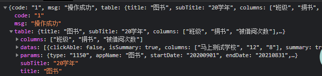

需要启动的应用类：


报表的数据定义：

ReportTable类对应整个报表表格======》

```
t_business_vcard_detail
```

784279041

### 平台账号密码

WebCatEE:	 账号：wangkaidong
					    密码：123Vxiao


```
// 2.调用消息中心能力 创建消息
if(!Objects.isNull(message)){
    // 创建消息
    msgExtDTO.setCreateParentType(createParentType.get(message.getType())==null?"0":createParentType.get(message.getType()));
    message = messageCenterService.create(msgExtDTO);
}
```

这段代码的判断是否出现错误？在第一部已经用应用的业务类创建完消息，这个判断是不是应该取消掉感叹号。


### 消息组件流程

```java
MessageController——》MessageHandler-》MessageComponentFacade-》具体业务实现类
```

### 报表组件流程

```java
ReportController--》ReportHandler--》具体业务实现类
```


fix:报表组件:S5报表组件接入  791027271

### 消费重构方案

vposConsume方法：

涉及的实体类：传入VcardDetail类 ----》 （TransactionDetailDTO类  ----》TransactionDetail类）  ----》返回TransactionResultDTO类

对应的数据库：


### 业务数据同步到大数据数据

#### 第一种：发送mq

​	1:在原有的业务类修改完数据发送mq

​	2:注入队列的消费者


​	3:建立监听器，根据Apptype进行具体业务分类监听


4:具体业务的监听器


5：服务类实现


#### 第二种：启动定时任务

1：新建具体业务的定时类BookTask.java


2:根据业务实体类的修改时间去进行同步更新信息


​							


```
BigDataWrapper类用于封装发送MQ的封装类 
```

```java
StorageDepositAllot              寄存柜类
StorageEquipmentAllotHistory     器材柜分配表  
StorageUserAllot                 储物柜用户分配表  
StoragePrizeHistory              兑奖柜 兑奖记录
StorageNutritionCabinetHistory   营养柜-格子分配    
```


```
public void sendBigdataMsg(List<BigDataWrapper> bigDataWrapperList){
    bigDataWrapperList.forEach(bigDataWrapper -> {
        rocketMQService.sendMessage(QueueTopic.TERMINAL_BIG_DATA_MSG,AppType.VSTORAGE,bigDataWrapper.toJsonBytes());
    });
}
```

消费-补贴规则制定


消费-补贴规则使用

1️⃣：每日上限

2️⃣：单次限比  百分比

3️⃣：每月上限


每日上限的金额存进redis缓存当中:

​		当用户查询没有时,设置value值为0,把每日上限存进redis,key是用户id+BaseRedisKey,过期时间是24小时减去当前时间。

​		当用户查询存在相对应的redis,取出redis。


业务逻辑：

1：先查询是否有补贴金额。

2：商品价格乘以单次限比得到本次消费的补贴最多能多少。与用户的补贴进行比较，如果用户剩下的补贴不够的话，就直接用剩下的补贴，够的话直接按照单次限比的补贴。

3：从每日上限Redis取出value，进行相加，与每日限额进行比较，大于发出警告，小于没事。

4：从每月上限Redis取出value，进行相加，与每日限额进行比较，大于发出警告，小于没事。

5：对用户剩下的补贴金额进行更新，返回本次消费真正可以使用的补贴金。


